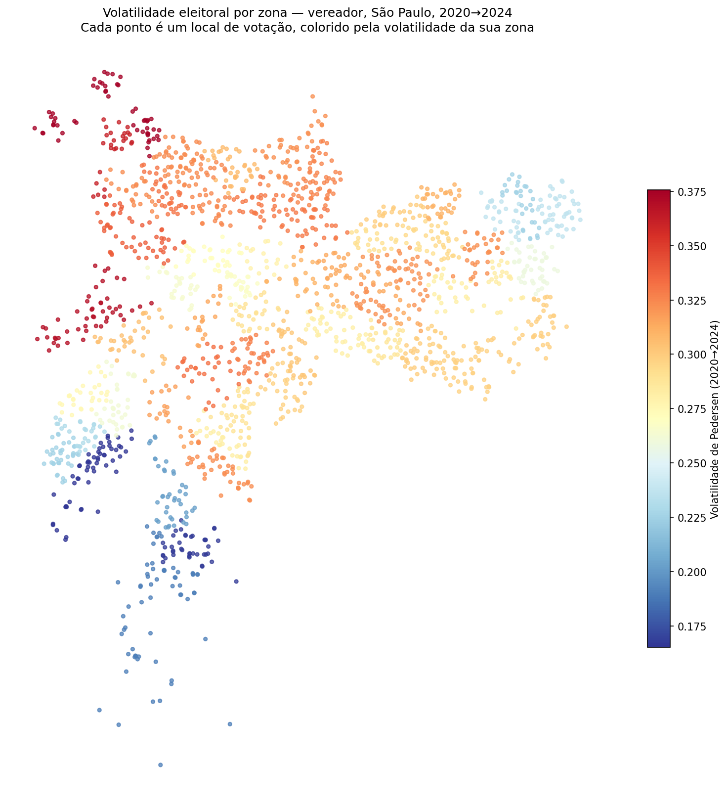
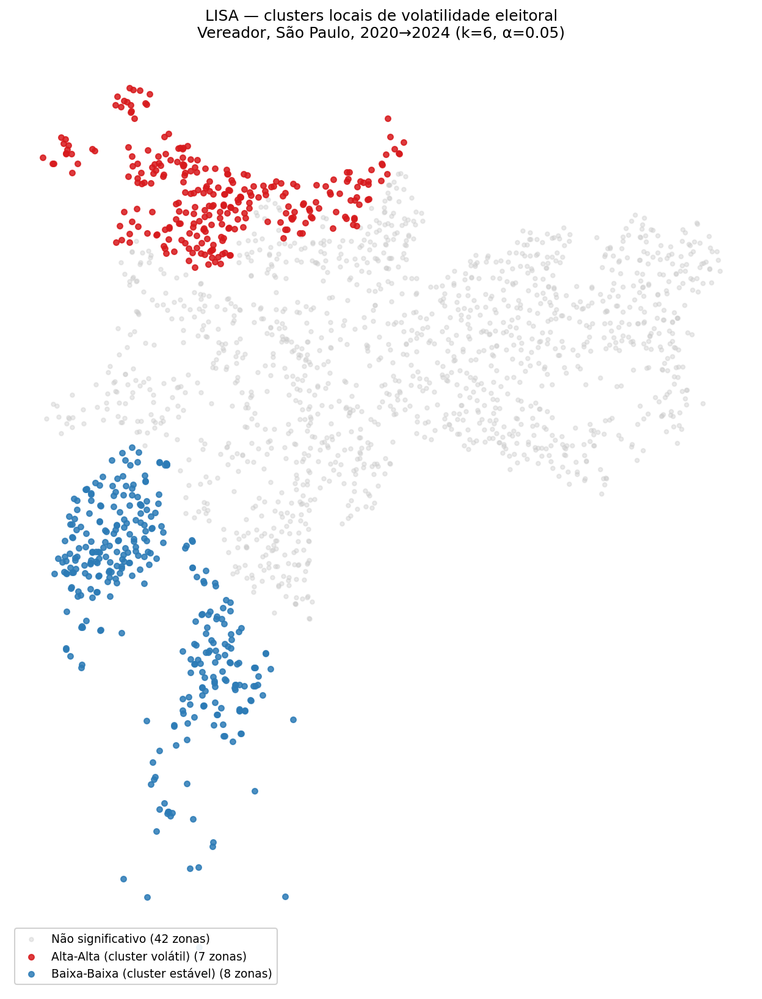

# Democracia em Dados

Projeto de ciência política computacional brasileira: variação territorial do voto, sucesso eleitoral e posicionamento discursivo, construído como laboratório de ciência de dados ponta a ponta (Python → SQL → estatística → ML → NLP → deploy).

*A Brazilian computational political science project: territorial variation in voting, electoral success and discursive positioning, built as an end-to-end data science lab.*

---

## Objetivo / Goal

Construir uma plataforma de análise eleitoral brasileira que integre dados do TSE, IBGE, BCB e Câmara dos Deputados, respondendo a três perguntas:

1. **Competição** — como varia territorialmente a competitividade eleitoral?
2. **Recursos** — o financiamento de campanha causa sucesso eleitoral? A reforma de 2015 mudou a representação feminina?
3. **Discurso** — é possível posicionar candidatos no espectro ideológico a partir de textos?

*Build a platform for Brazilian electoral analysis integrating TSE, IBGE, BCB and Chamber of Deputies data, answering three questions: how electoral competition varies territorially, whether campaign finance causes electoral success, and whether candidates can be ideologically positioned from text.*

---

## Primeiro achado — Volatilidade eleitoral por zona, SP vereador 2020→2024

*First finding — Electoral volatility by zone, São Paulo city council 2020→2024*

Usando `votacao_partido_munzona` do TSE, com normalização de partidos por federações 2024 (PT/PCdoB/PV, PSDB/Cidadania, PSOL/Rede) e fusões (DEM+PSL→União, etc.), calculamos o **Índice de Pedersen** para as eleições de vereador.

| Métrica | Valor |
|---|---|
| Volatilidade da cidade | **0.257** |
| Zonas analisadas | 57 |
| Volatilidade média / mediana | 0.292 / 0.299 |
| Mínima / máxima por zona | 0.165 / 0.376 |
| **Moran I** (KNN, k=6, 999 perm) | **0.42** (p = 0.001) |

### Mapa de pontos — volatilidade por zona



### Clusters LISA — onde estão os regimes distintos



O Moran Local identifica **dois blocos territorialmente coerentes**, sem outliers espaciais:

- **Cluster volátil (HH, 7 zonas) — periferia norte/noroeste**: Perus, Jaraguá, Brasilândia, Pirituba, Nossa Senhora do Ó, Tucuruvi, Lauzane Paulista.
- **Cluster estável (LL, 8 zonas) — periferia sul**: Grajaú, Parelheiros, Capela do Socorro, Capão Redondo, Jardim São Luís, Campo Limpo, Piraporinha, Valo Velho.

Resultado contraintuitivo: não é "centro vs periferia". São **duas periferias com comportamentos eleitorais opostos**. Ambas são regiões de renda mais baixa, mas a zona sul se mostrou substancialmente mais consistente partidariamente que a norte entre 2020 e 2024.

*Replicate with:* `python analise_volatilidade.py` · `python mapa_volatilidade.py` · `python moran_volatilidade.py` · `python lisa_volatilidade.py`

Geometria: [Locais de votação georreferenciados do CEM/USP](https://centrodametropole.fflch.usp.br/pt-br/download-de-dados) (EL2022_LV_ESP_CEM_V2).

---

## Estrutura / Structure

```
democracia-em-dados/
├── src/
│   └── dominio/
│       ├── __init__.py       # reexporta Candidato, ResultadoEleitoral
│       ├── candidato.py      # Candidato + UFS_VALIDAS
│       └── resultado.py      # ResultadoEleitoral
├── tests/
│   └── test_resultado.py     # pytest — 19 testes
├── exemplo.py                # uso mínimo das classes
└── README.md
```

Planejado: `src/ingestao/` (TSE/BCB), `src/analise/` (SQL + estatística), `src/nlp/`, `docs/ementas/`.

---

## Como rodar / How to run

```bash
conda activate radiografia
pip install pytest
pytest tests/ -q
python exemplo.py
```

---

## Roadmap — 16 semanas / 16-week roadmap

| Semana | Foco | Entregável |
|---|---|---|
| 1 | POO + testes + Git | `Candidato`, `ResultadoEleitoral`, 19 testes ✅ |
| 2 | Composição + pacote `src/` | `EleicaoMunicipal`, fragmentação, volatilidade |
| 3 | Ingestão TSE via API | `TSEDownloader` (POO), dados em parquet |
| 4 | SQL — modelagem | Schema MySQL normalizado, carga inicial |
| 5 | SQL — eixo competição | Window functions, CTEs, 10 queries |
| 6 | SQL — eixo financiamento | Gap de gênero, custo por voto |
| 7 | Regressão linear + diagnóstico | VIF, Breusch-Pagan, resíduos |
| 8 | Regressão logística | Odds ratios, efeitos marginais |
| 9 | Inferência causal (DiD) | Efeito da reforma de 2015 |
| 10 | Pipeline ML | ColumnTransformer, CV estratificada |
| 11 | Comparação de modelos | LogReg, RF, XGBoost, LightGBM + SHAP |
| 12 | NLP baseline + deploy | TF-IDF, FastAPI, Docker |
| 13 | Análise espacial | Moran I, LISA, mapas coropléticos |
| 14 | PCA + índices sintéticos | Índice socioeconômico municipal |
| 15 | Modelos de contagem | Poisson, NB, Zero-inflated |
| 16 | Multinível + cloud | Modelo hierárquico, deploy AWS |

---

## Stack

Python 3.11, pandas, scikit-learn, statsmodels, pytest, MySQL, FastAPI, Docker.

---

## Licença / License

MIT
