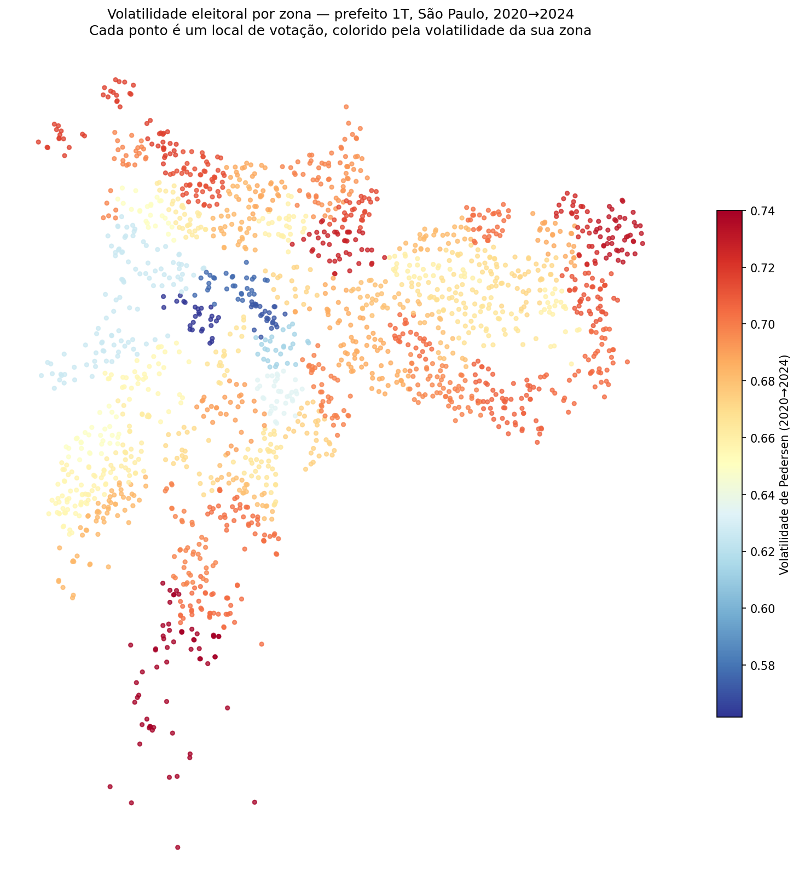
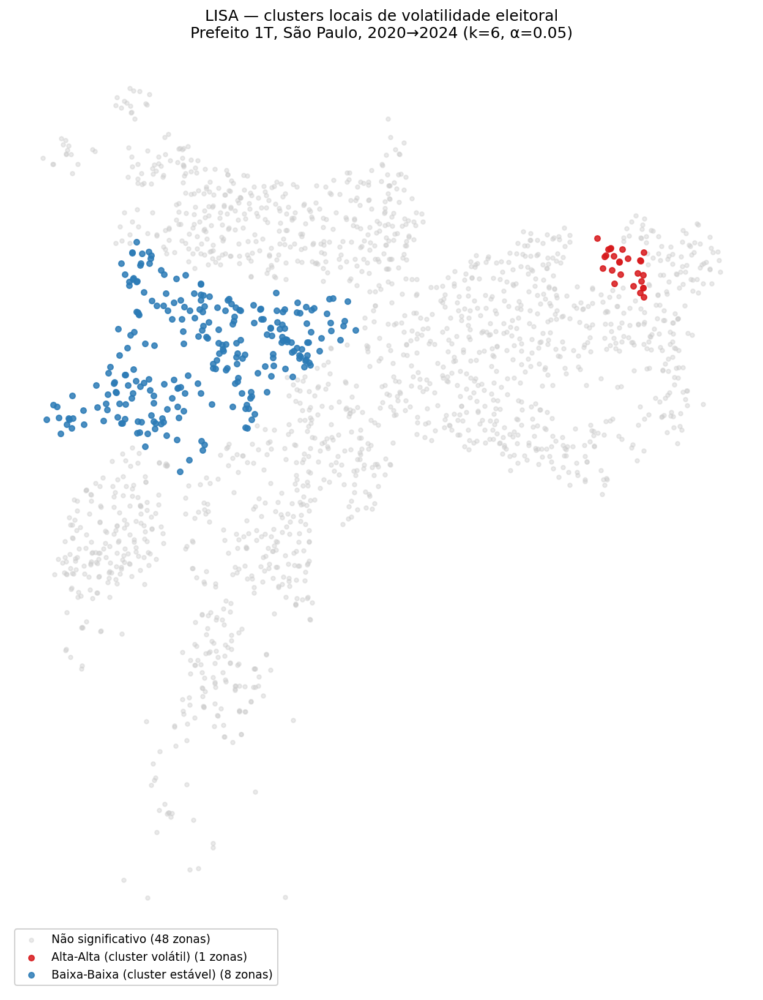

# Democracia em Dados

Projeto de ciência política computacional brasileira: variação territorial do voto, sucesso eleitoral e posicionamento discursivo, construído como laboratório de ciência de dados ponta a ponta (Python → SQL → estatística → ML → NLP → deploy).

*A Brazilian computational political science project: territorial variation in voting, electoral success and discursive positioning, built as an end-to-end data science lab.*

---

## Objetivo / Goal

Construir uma plataforma de análise eleitoral brasileira que integre dados do TSE, IBGE, BCB e Câmara dos Deputados, respondendo a três perguntas:

1. **Competição** — como varia territorialmente a competitividade eleitoral?
2. **Recursos** — o financiamento de campanha causa sucesso eleitoral? A reforma de 2015 mudou a representação feminina?
3. **Discurso** — é possível posicionar candidatos no espectro ideológico a partir de textos?

*Build a platform for Brazilian electoral analysis integrating TSE, IBGE, BCB and Chamber of Deputies data, answering three questions: how electoral competition varies territorially, whether campaign finance causes electoral success, and whether candidates can be ideologically positioned from text.*

---

## Primeiro achado — Volatilidade eleitoral por zona, SP vereador 2020→2024

*First finding — Electoral volatility by zone, São Paulo city council 2020→2024*

Usando `votacao_partido_munzona` do TSE, com normalização de partidos por federações 2024 (PT/PCdoB/PV, PSDB/Cidadania, PSOL/Rede) e fusões (DEM+PSL→União, etc.), calculamos o **Índice de Pedersen** para as eleições de vereador.

| Métrica | Valor |
|---|---|
| Volatilidade da cidade | **0.257** |
| Zonas analisadas | 57 |
| Volatilidade média / mediana | 0.292 / 0.299 |
| Mínima / máxima por zona | 0.165 / 0.376 |
| **Moran I** (KNN, k=6, 999 perm) | **0.42** (p = 0.001) |

### Mapa de pontos — volatilidade por zona


### Clusters LISA — onde estão os regimes distintos


O Moran Local identifica **dois blocos territorialmente coerentes**, sem outliers espaciais:

- **Cluster volátil (HH, 7 zonas) — periferia norte/noroeste**: Perus, Jaraguá, Brasilândia, Pirituba, Nossa Senhora do Ó, Tucuruvi, Lauzane Paulista.
- **Cluster estável (LL, 8 zonas) — periferia sul**: Grajaú, Parelheiros, Capela do Socorro, Capão Redondo, Jardim São Luís, Campo Limpo, Piraporinha, Valo Velho.

Resultado contraintuitivo: não é "centro vs periferia". São **duas periferias com comportamentos eleitorais opostos**. Ambas são regiões de renda mais baixa, mas a zona sul se mostrou substancialmente mais consistente partidariamente que a norte entre 2020 e 2024.

*Replicate with:* `python analise_volatilidade.py` · `python mapa_volatilidade.py` · `python moran_volatilidade.py` · `python lisa_volatilidade.py`

---

### Segundo achado — Prefeito 1T, e a inversão dos regimes

*Second finding — Mayor 1st round, and the regime inversion*

Replicando exatamente o mesmo pipeline para a eleição **majoritária de prefeito (1º turno)**, o padrão muda drasticamente:

| Métrica | Vereador | Prefeito 1T |
|---|---:|---:|
| Pedersen — cidade | 0.257 | **0.673** |
| Volatilidade média por zona | 0.292 | 0.676 |
| Amplitude (mín / máx) | 0.165 / 0.376 | 0.562 / 0.740 |
| Moran I (KNN, k=6) | 0.42 (p = 0.001) | 0.40 (p = 0.001) |
| Cluster HH (volátil) | 7 zonas — periferia norte | **1 zona** — São Miguel Paulista |
| Cluster LL (estável) | 8 zonas — periferia sul | **8 zonas** — centro e oeste ricos |





O cluster estável do prefeito forma uma **mancha contígua no centro-oeste de alta renda**: Pinheiros, Bela Vista, Perdizes, Lapa, Butantã, Jardim Paulista, Santa Ifigênia, Rio Pequeno.

**O achado central da comparação:** os regimes territoriais se **invertem** entre proporcional e majoritária. A periferia sul — partidariamente fiel no vereador — some do radar no prefeito. O centro rico — irrelevante no vereador — torna-se o único refúgio de estabilidade na disputa majoritária. **Fidelidade de legenda ≠ fidelidade de candidato.**

A volatilidade do prefeito é ~2,6× maior que a do vereador em larga medida por rotação da *oferta*: PSDB/Cidadania saiu de 1.75M votos em 2020 para 112k em 2024; PRTB saltou de 12k para 1.7M (efeito Marçal); MDB emergiu de ~0 para 1.8M (Nunes). Em eleição majoritária, Pedersen mede mudança de eleitorado e mudança de oferta misturadas.

*Replicate with:* `python mapa_lisa_prefeito.py`

Geometria: [Locais de votação georreferenciados do CEM/USP](https://centrodametropole.fflch.usp.br/pt-br/download-de-dados) (EL2022_LV_ESP_CEM_V2).

---

### Terceiro achado — Decomposição da volatilidade (Bartolini & Mair)

*Third finding — Volatility decomposition (Bartolini & Mair)*

A volatilidade bruta de Pedersen mede qualquer rotação entre siglas, sem distinguir se o eleitorado mudou de **campo ideológico** ou apenas trocou de partido dentro do mesmo campo. A decomposição de Bartolini & Mair (1990) separa essas duas componentes:

- **V_total**: rotação partido a partido (Pedersen clássico)
- **V_entre blocos**: rotação entre blocos ideológicos agregados
- **V_dentro blocos**: V_total − V_entre (rotação intra-campo)

Usamos os escores de [Bolognesi, Ribeiro & Codato (2023)](https://doi.org/10.1590/dados.2023.66.2.303), survey com especialistas da ABCP em 2018, escala 0–10.

**Resultado em 3 blocos** (esquerda ≤ 4.49, centro 4.5–5.5, direita > 5.5):

| | V_total | V_entre | V_dentro | % entre |
|---|---:|---:|---:|---:|
| Vereador | 0.257 | 0.007 | 0.250 | **2.6%** |
| Prefeito 1T | 0.673 | 0.042 | 0.631 | **6.2%** |

**Resultado em 5 blocos** (esquerda ≤ 3, centro-esquerda ≤ 4.49, centro ≤ 5.5, centro-direita ≤ 7, direita > 7):

| | V_total | V_entre | V_dentro | % entre |
|---|---:|---:|---:|---:|
| Vereador | 0.257 | 0.144 | 0.113 | **55.8%** |
| Prefeito 1T | 0.673 | 0.352 | 0.321 | **52.3%** |

A diferença entre as duas leituras é causada principalmente pelo **MDB** (escore 7.01 no Bolognesi et al., exatamente na fronteira centro-direita/direita). O MDB levou 1.8M votos para Nunes em 2024; dependendo do bloco em que ele cai, a migração aparente muda drasticamente. A tabela abaixo mostra a sensibilidade:

| Limiar C-DIR/DIR | Vereador V_entre | Prefeito V_entre |
|---:|---:|---:|
| 7.00 (paper — MDB → DIR) | 55.8% | 52.3% |
| 7.05 (MDB → C-DIR) | 29.8% | 8.5% |
| 7.10 | 29.1% | 10.8% |
| 7.50 | 34.4% | 22.5% |

**Distribuição em 5 blocos (prefeito 1T):**

| Bloco | 2020 | 2024 |
|---|---:|---:|
| Esquerda | 0.1% | 0.1% |
| Centro-esquerda | 43.2% | 39.0% |
| Centro | 0% | 0% |
| Centro-direita | 32.9% | 1.8% |
| Direita | 23.9% | 59.0% |

**O que é robusto em todos os cenários:** o campo **esquerda + centro-esquerda** fica praticamente congelado (31% ↔ 31% no vereador; 43% ↔ 39% no prefeito). **A migração, qualquer que seja a régua usada, acontece dentro do campo de direita *lato sensu*** — o eleitorado paulistano entre 2020 e 2024 não mudou de lado ideológico; redistribuiu votos dentro do próprio campo, com o colapso da centro-direita histórica (PSDB/Cidadania) sendo capturado por PL, Republicanos, MDB, PP, Novo.

**Leitura central:** a "alta volatilidade" observada em Pedersen bruto é em larga medida *fragmentação intra-campo*, não *realinhamento entre campos*. O resultado é consistente com a tese de Bolognesi et al. de uma "tendência centrífuga à direita" do sistema partidário brasileiro.

*Replicate with:* `python ideologia.py` (ou importando as funções em outro script).

Referência: Bolognesi, B.; Ribeiro, E.; Codato, A. (2023). "Uma Nova Classificação Ideológica dos Partidos Políticos Brasileiros". *Dados* 66(2).

---

## Estrutura / Structure

```
democracia-em-dados/
├── src/
│   └── dominio/
│       ├── __init__.py       # reexporta Candidato, ResultadoEleitoral
│       ├── candidato.py      # Candidato + UFS_VALIDAS
│       └── resultado.py      # ResultadoEleitoral
├── tests/
│   └── test_resultado.py     # pytest — 19 testes
├── exemplo.py                # uso mínimo das classes
└── README.md
```

Planejado: `src/ingestao/` (TSE/BCB), `src/analise/` (SQL + estatística), `src/nlp/`, `docs/ementas/`.

---

## Como rodar / How to run

```bash
conda activate radiografia
pip install pytest
pytest tests/ -q
python exemplo.py
```

---

## Roadmap — 16 semanas / 16-week roadmap

| Semana | Foco | Entregável |
|---|---|---|
| 1 | POO + testes + Git | `Candidato`, `ResultadoEleitoral`, 19 testes ✅ |
| 2 | Composição + pacote `src/` | `EleicaoMunicipal`, fragmentação, volatilidade |
| 3 | Ingestão TSE via API | `TSEDownloader` (POO), dados em parquet |
| 4 | SQL — modelagem | Schema MySQL normalizado, carga inicial |
| 5 | SQL — eixo competição | Window functions, CTEs, 10 queries |
| 6 | SQL — eixo financiamento | Gap de gênero, custo por voto |
| 7 | Regressão linear + diagnóstico | VIF, Breusch-Pagan, resíduos |
| 8 | Regressão logística | Odds ratios, efeitos marginais |
| 9 | Inferência causal (DiD) | Efeito da reforma de 2015 |
| 10 | Pipeline ML | ColumnTransformer, CV estratificada |
| 11 | Comparação de modelos | LogReg, RF, XGBoost, LightGBM + SHAP |
| 12 | NLP baseline + deploy | TF-IDF, FastAPI, Docker |
| 13 | Análise espacial | Moran I, LISA, mapas coropléticos |
| 14 | PCA + índices sintéticos | Índice socioeconômico municipal |
| 15 | Modelos de contagem | Poisson, NB, Zero-inflated |
| 16 | Multinível + cloud | Modelo hierárquico, deploy AWS |

---

## Stack

Python 3.11, pandas, scikit-learn, statsmodels, pytest, MySQL, FastAPI, Docker.

---

## Licença / License

MIT
