# Democracia em Dados

Projeto de ciência política computacional brasileira: variação territorial do voto, sucesso eleitoral e posicionamento discursivo, construído como laboratório de ciência de dados ponta a ponta (Python → SQL → estatística → ML → NLP → deploy).

*A Brazilian computational political science project: territorial variation in voting, electoral success and discursive positioning, built as an end-to-end data science lab.*

---

## Objetivo / Goal

Construir uma plataforma de análise eleitoral brasileira que integre dados do TSE, IBGE, BCB e Câmara dos Deputados, respondendo a três perguntas:

1. **Competição** — como varia territorialmente a competitividade eleitoral?
2. **Recursos** — o financiamento de campanha causa sucesso eleitoral? A reforma de 2015 mudou a representação feminina?
3. **Discurso** — é possível posicionar candidatos no espectro ideológico a partir de textos?

*Build a platform for Brazilian electoral analysis integrating TSE, IBGE, BCB and Chamber of Deputies data, answering three questions: how electoral competition varies territorially, whether campaign finance causes electoral success, and whether candidates can be ideologically positioned from text.*

---

## Primeiro achado — Volatilidade eleitoral por zona, SP vereador 2020→2024

*First finding — Electoral volatility by zone, São Paulo city council 2020→2024*

Usando `votacao_partido_munzona` do TSE, com normalização de partidos por federações 2024 (PT/PCdoB/PV, PSDB/Cidadania, PSOL/Rede) e fusões (DEM+PSL→União, etc.), calculamos o **Índice de Pedersen** para as eleições de vereador.

| Métrica | Valor |
|---|---|
| Volatilidade da cidade | **0.257** |
| Zonas analisadas | 57 |
| Volatilidade média / mediana | 0.292 / 0.299 |
| Mínima / máxima por zona | 0.165 / 0.376 |
| **Moran I** (KNN, k=6, 999 perm) | **0.42** (p = 0.001) |

### Mapa de pontos — volatilidade por zona

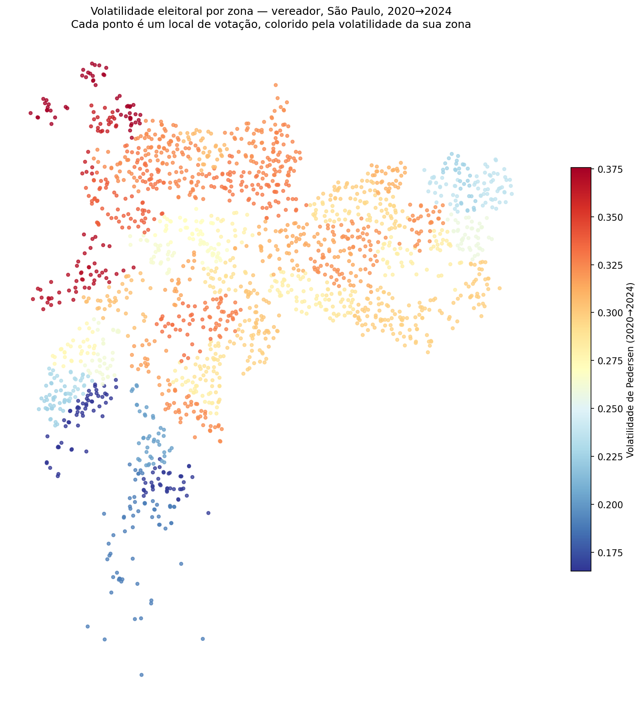

### Clusters LISA — onde estão os regimes distintos

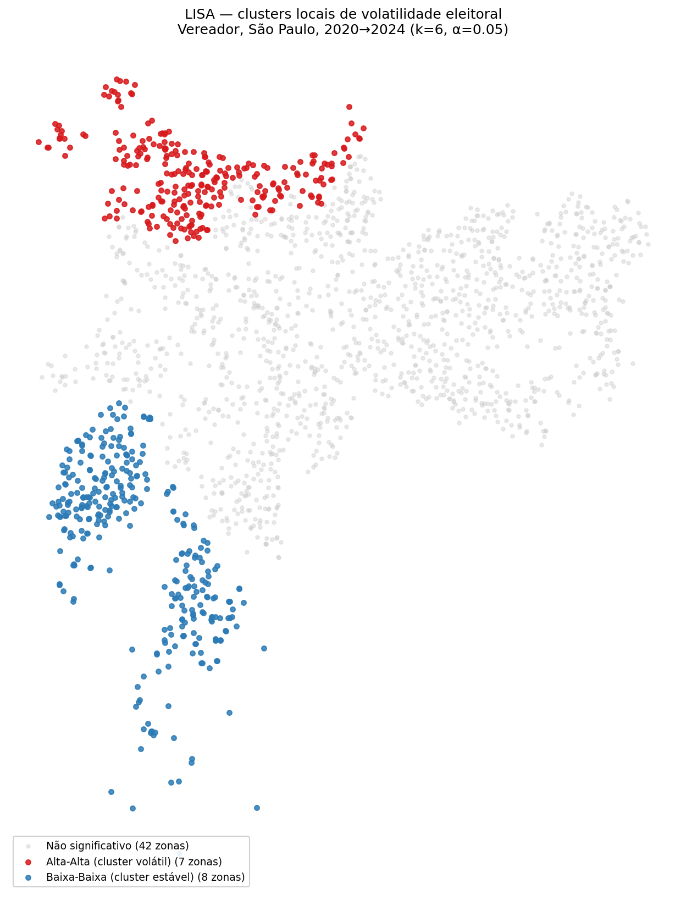

O Moran Local identifica **dois blocos territorialmente coerentes**, sem outliers espaciais:

- **Cluster volátil (HH, 7 zonas) — periferia norte/noroeste**: Perus, Jaraguá, Brasilândia, Pirituba, Nossa Senhora do Ó, Tucuruvi, Lauzane Paulista.
- **Cluster estável (LL, 8 zonas) — periferia sul**: Grajaú, Parelheiros, Capela do Socorro, Capão Redondo, Jardim São Luís, Campo Limpo, Piraporinha, Valo Velho.

Resultado contraintuitivo: não é "centro vs periferia". São **duas periferias com comportamentos eleitorais opostos**. Ambas são regiões de renda mais baixa, mas a zona sul se mostrou substancialmente mais consistente partidariamente que a norte entre 2020 e 2024.

*Replicate with:* `python analise_volatilidade.py` · `python mapa_volatilidade.py` · `python moran_volatilidade.py` · `python lisa_volatilidade.py`

---

### Segundo achado — Prefeito 1T, e a inversão dos regimes

*Second finding — Mayor 1st round, and the regime inversion*

Replicando exatamente o mesmo pipeline para a eleição **majoritária de prefeito (1º turno)**, o padrão muda drasticamente:

| Métrica | Vereador | Prefeito 1T |
|---|---:|---:|
| Pedersen — cidade | 0.257 | **0.673** |
| Volatilidade média por zona | 0.292 | 0.676 |
| Amplitude (mín / máx) | 0.165 / 0.376 | 0.562 / 0.740 |
| Moran I (KNN, k=6) | 0.42 (p = 0.001) | 0.40 (p = 0.001) |
| Cluster HH (volátil) | 7 zonas — periferia norte | **1 zona** — São Miguel Paulista |
| Cluster LL (estável) | 8 zonas — periferia sul | **8 zonas** — centro e oeste ricos |

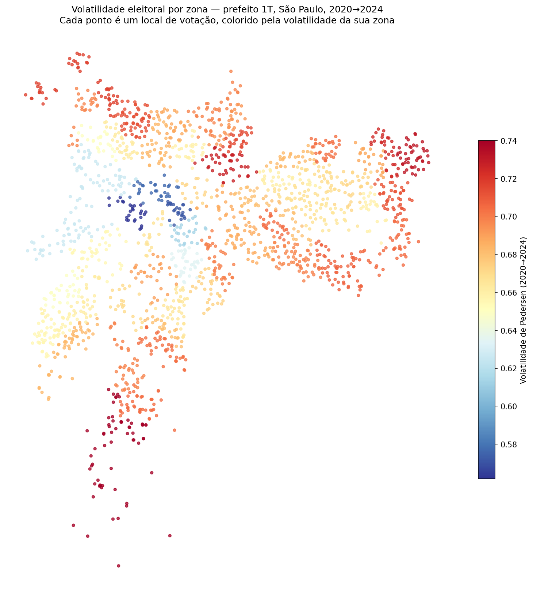

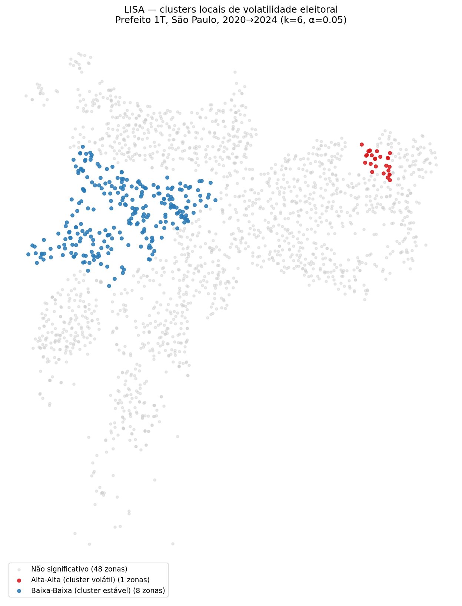

O cluster estável do prefeito forma uma **mancha contígua no centro-oeste de alta renda**: Pinheiros, Bela Vista, Perdizes, Lapa, Butantã, Jardim Paulista, Santa Ifigênia, Rio Pequeno.

**O achado central da comparação:** os regimes territoriais se **invertem** entre proporcional e majoritária. A periferia sul — partidariamente fiel no vereador — some do radar no prefeito. O centro rico — irrelevante no vereador — torna-se o único refúgio de estabilidade na disputa majoritária. **Fidelidade de legenda ≠ fidelidade de candidato.**

A volatilidade do prefeito é ~2,6× maior que a do vereador em larga medida por rotação da *oferta*: PSDB/Cidadania saiu de 1.75M votos em 2020 para 112k em 2024; PRTB saltou de 12k para 1.7M (efeito Marçal); MDB emergiu de ~0 para 1.8M (Nunes). Em eleição majoritária, Pedersen mede mudança de eleitorado e mudança de oferta misturadas.

*Replicate with:* `python mapa_lisa_prefeito.py`

Geometria: [Locais de votação georreferenciados do CEM/USP](https://centrodametropole.fflch.usp.br/pt-br/download-de-dados) (EL2022_LV_ESP_CEM_V2).

---

### Terceiro achado — Decomposição da volatilidade (Bartolini & Mair)

*Third finding — Volatility decomposition (Bartolini & Mair)*

A volatilidade bruta de Pedersen mede qualquer rotação entre siglas, sem distinguir se o eleitorado mudou de **campo ideológico** ou apenas trocou de partido dentro do mesmo campo. A decomposição de Bartolini & Mair (1990) separa essas duas componentes:

- **V_total**: rotação partido a partido (Pedersen clássico)
- **V_entre blocos**: rotação entre blocos ideológicos agregados
- **V_dentro blocos**: V_total − V_entre (rotação intra-campo)

Usamos os escores de [Bolognesi, Ribeiro & Codato (2023)](https://doi.org/10.1590/dados.2023.66.2.303), survey com especialistas da ABCP em 2018, escala 0–10.

**Resultado em 3 blocos** (esquerda ≤ 4.49, centro 4.5–5.5, direita > 5.5):

| | V_total | V_entre | V_dentro | % entre |
|---|---:|---:|---:|---:|
| Vereador | 0.257 | 0.007 | 0.250 | **2.6%** |
| Prefeito 1T | 0.673 | 0.042 | 0.631 | **6.2%** |

**Resultado em 5 blocos** (esquerda ≤ 3, centro-esquerda ≤ 4.49, centro ≤ 5.5, centro-direita ≤ 7, direita > 7):

| | V_total | V_entre | V_dentro | % entre |
|---|---:|---:|---:|---:|
| Vereador | 0.257 | 0.144 | 0.113 | **55.8%** |
| Prefeito 1T | 0.673 | 0.352 | 0.321 | **52.3%** |

A diferença entre as duas leituras é causada principalmente pelo **MDB** (escore 7.01 no Bolognesi et al., exatamente na fronteira centro-direita/direita). O MDB levou 1.8M votos para Nunes em 2024; dependendo do bloco em que ele cai, a migração aparente muda drasticamente. A tabela abaixo mostra a sensibilidade:

| Limiar C-DIR/DIR | Vereador V_entre | Prefeito V_entre |
|---:|---:|---:|
| 7.00 (paper — MDB → DIR) | 55.8% | 52.3% |
| 7.05 (MDB → C-DIR) | 29.8% | 8.5% |
| 7.10 | 29.1% | 10.8% |
| 7.50 | 34.4% | 22.5% |

**Distribuição em 5 blocos (prefeito 1T):**

| Bloco | 2020 | 2024 |
|---|---:|---:|
| Esquerda | 0.1% | 0.1% |
| Centro-esquerda | 43.2% | 39.0% |
| Centro | 0% | 0% |
| Centro-direita | 32.9% | 1.8% |
| Direita | 23.9% | 59.0% |

**O que é robusto em todos os cenários:** o campo **esquerda + centro-esquerda** fica praticamente congelado (31% ↔ 31% no vereador; 43% ↔ 39% no prefeito). **A migração, qualquer que seja a régua usada, acontece dentro do campo de direita *lato sensu*** — o eleitorado paulistano entre 2020 e 2024 não mudou de lado ideológico; redistribuiu votos dentro do próprio campo, com o colapso da centro-direita histórica (PSDB/Cidadania) sendo capturado por PL, Republicanos, MDB, PP, Novo.

**Leitura central:** a "alta volatilidade" observada em Pedersen bruto é em larga medida *fragmentação intra-campo*, não *realinhamento entre campos*. O resultado é consistente com a tese de Bolognesi et al. de uma "tendência centrífuga à direita" do sistema partidário brasileiro.

*Replicate with:* `python ideologia.py` (ou importando as funções em outro script).

Referência: Bolognesi, B.; Ribeiro, E.; Codato, A. (2023). "Uma Nova Classificação Ideológica dos Partidos Políticos Brasileiros". *Dados* 66(2).

---

### Quarto achado — Índice institucional cultural-progressista por zona

*Fourth finding — Cultural-progressive institutional index by zone*

A hipótese alternativa ao voto de classe: zonas com maior densidade de instituições educativo-culturais de perfil cosmopolita/universitário/progressista (Mackenzie, PUC, USP, escolas Vera Cruz/Equipe/Lumiar, prestígio público — Caetano de Campos, Amorim Lima — e cultural-internacional — Goethe, Aliança Francesa) explicam o voto progressista melhor do que renda.

| Modelo | R² (escore vereador 2024) |
|---|---:|
| escore ~ renda per capita | 0.088 |
| escore ~ renda + índice institucional | **0.439** |
| escore ~ índice institucional sozinho | 0.437 |

A correlação entre **índice institucional × escore vereador 2024**: r = **−0.66**. O componente "renda" tem efeito quase zero quando o índice está controlado.

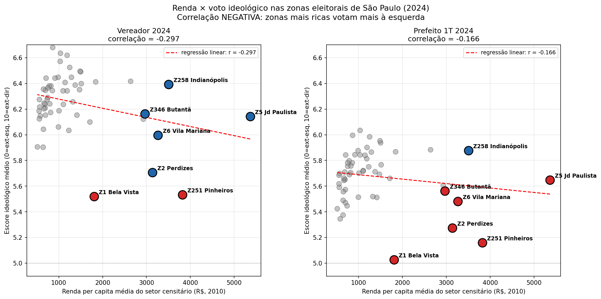

*Replicate with:* `python -m src.urbano.indice_institucional`

---

### Quinto achado — Robustez do índice (5 testes formais)

*Fifth finding — Five formal robustness tests*

Quatro testes de robustez na esquerda + replicação simétrica na direita confirmam que o efeito do índice institucional é específico, robusto e não-redundante com renda/escolaridade.

**Teste A — Crescimento da esquerda × índice institucional (variação % vereador 2012→2024):**

| Modelo | β | R² | p-valor |
|---|---:|---:|---:|
| Esquerda | +2.32 | **0.313** | 5.1×10⁻⁶ \*\*\* |
| Direita (mesma regressão) | −0.72 | 0.012 | 0.42 (n.s.) |

A relação é **assimétrica**: o índice prediz crescimento da esquerda (R²=0.31), não tem efeito sobre a direita.

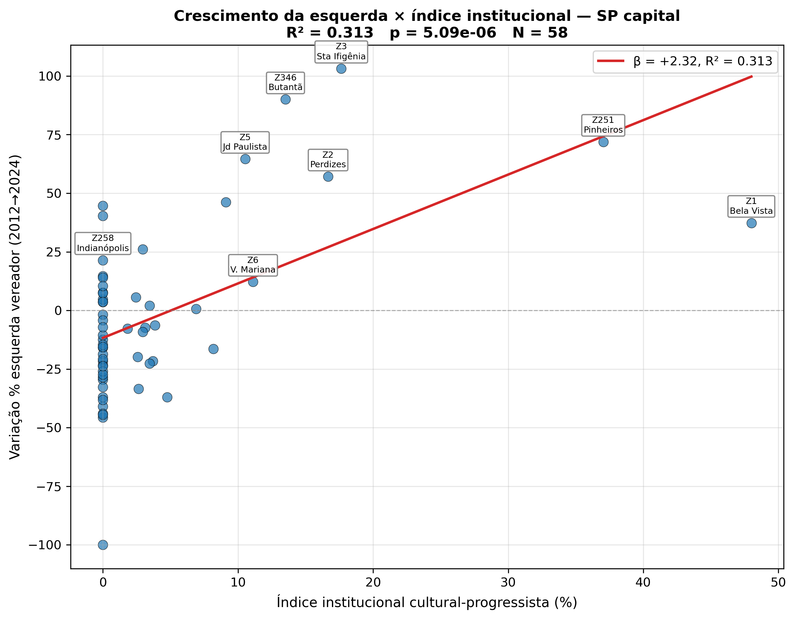

**Teste B — Correlação 5×5 entre cargos** (variações % por zona):

|  | Vereador | Dep.Fed. | Gov. | Pres. | Prefeito |
|---|---|---|---|---|---|
| Vereador | 1.00 | 0.56 | 0.50 | 0.46 | **0.81** |
| Dep. Federal | 0.56 | 1.00 | **0.96** | **0.94** | 0.48 |
| Governador | 0.50 | 0.96 | 1.00 | **0.99** | 0.50 |
| Presidente | 0.46 | 0.94 | 0.99 | 1.00 | 0.42 |
| Prefeito | **0.81** | 0.48 | 0.50 | 0.42 | 1.00 |

**Estrutura em duas dimensões:** cluster federal (Pres-Gov-Dep.Fed., r > 0.94) e cluster municipal (Vereador-Prefeito, r = 0.81), com correlação inter-blocos só ~0.5. Voto diferenciado por nível formalmente comprovado.

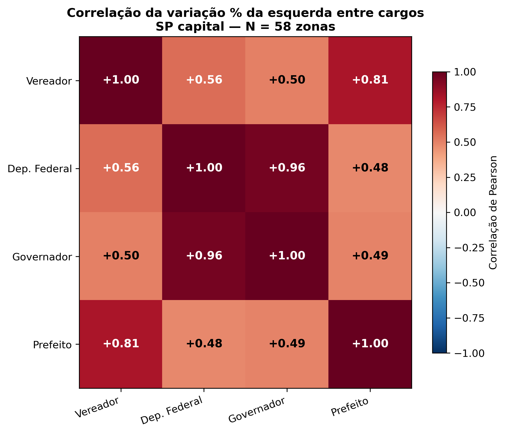

**Teste C — Concentração territorial 2000-2024 (HHI/Gini):**

A esquerda **não se concentrou** territorialmente — Gini caiu 20% entre 2000 e 2024 (0.188 → 0.149). A direita também se espalhou (0.188 → 0.134). Hipótese popular de "elitização da esquerda" é rejeitada pelos dados.

**Teste D — Quebra estrutural do PSOL para vereador (Chow test):**

A inflexão da curva de crescimento do PSOL nas top-10 zonas por índice institucional ocorre em **2016** (F=44.6, p=0.006), quatro anos antes da candidatura de Boulos a presidente. Crescimento anual passa de ~1.155 para ~10.063 votos/ano (9× mais rápido). Realinhamento estrutural antecede efeito-candidato.

**Análise simétrica:** o índice institucional **não tem efeito** sobre o voto de direita (R²=0.01, p=0.42). Direita cresceu +89% em todas as zonas, uniformemente. O índice é específico ao bloco esquerda.

*Replicate with:* `src/sintese/regressao_crescimento_indice.py`, `correlacao_entre_cargos.py`, `concentracao_territorial.py`, `quebra_estrutural_psol.py`, `analise_direita.py`

---

### Sexto achado — O índice não é proxy de renda nem escolaridade

*Sixth finding — The index is not a proxy for income or education*

Controle por covariáveis socioeconômicas reais: % superior completo do Censo 2010 (amostra → área de ponderação → zona via spatial join). Sete modelos OLS para variação % esquerda vereador 2012→2024:

| Modelo | R² |
|---|---:|
| M1: só índice | 0.313 |
| M2: só renda 2010 | 0.334 |
| M3: só renda 2022 | 0.326 |
| M4: só pct_superior | 0.330 |
| M5: renda 2010 + 2022 | 0.334 |
| M6: renda + superior (sem índice) | 0.342 |
| **M7: renda + superior + índice** | **0.432** |

**Ganho marginal do índice sobre renda + escolaridade real: +9.0 pp.** Coeficiente padronizado do índice em M7 é o maior do modelo (+13.5); de pct_superior é −3.5 (vira irrelevante quando índice está controlado).

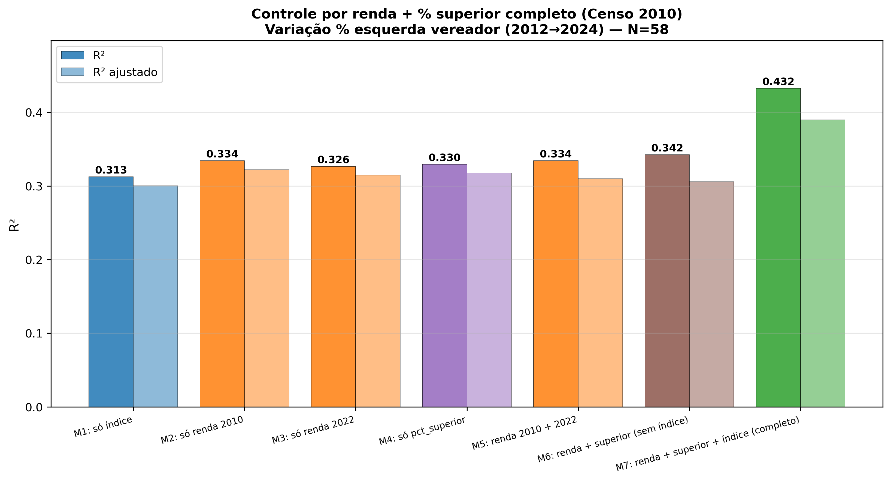

**Análise de discordância (casos off-the-line):** zonas com **alta escolaridade mas baixo índice** (Mooca, Tatuapé, Vila Prudente, Casa Verde — Q2) **caem como periferia**, não como elite progressista. Distância Q2→Q4 = 16pp; distância Q2→Q1 = 28pp. **Escolaridade alta sozinha não produz voto progressista** — precisa estar combinada com ambiente institucional.

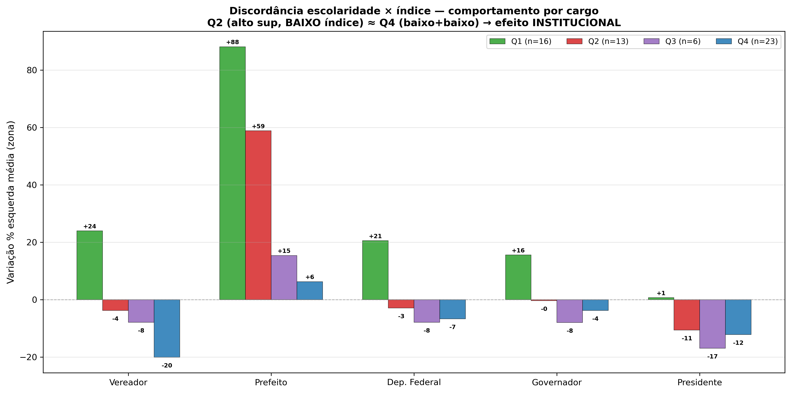

Padrão se mantém em 4 de 5 cargos (vereador, dep. federal, governador, presidente). Única exceção: prefeito, onde o efeito Boulos 2024 puxou voto em zonas Q2 — coerente com o "personalismo" do cargo no Teste B.

*Replicate with:* `src/sintese/controle_renda_escolaridade_v3.py`, `discordancia_superior_indice_5cargos.py`

---

### Sétimo achado — Bolsonaro × Tarcísio em 2022: dois mecanismos da direita

*Seventh finding — Bolsonaro × Tarcísio 2022: two mechanisms in the right wing*

Bolsonaro (Pres) e Tarcísio (Gov) andam juntos por zona (r=+0.981) — Bolsonaro supera Tarcísio em **TODAS** as 58 zonas. Mas a **diferença varia por território**:

- **Zonas centrais ricas** (Pinheiros, Jd Paulista, Perdizes): Tarcísio fica 10-16% atrás
- **Zonas periféricas** (Cidade Tiradentes, Parelheiros, Brasilândia): Tarcísio fica 25-27% atrás

Hipótese inicial: bolsonarismo periférico mais "personalista". Hipótese refinada (após teste): **competição estrutural** — onde Haddad/PT é hegemônico (correlação Haddad-prefeito 2012 × Lula 2022 = +0.94 — PT manteve sua base), sobra menos espaço para Tarcísio.

| Modelo | R² |
|---|---:|
| gap% ~ índice institucional | 0.356 |
| gap% ~ haddad_share | 0.388 |
| **gap% ~ haddad_share + índice** | **0.774** |

Os dois mecanismos são **independentes e aditivos**. Juntos explicam 77% da variância do gap.

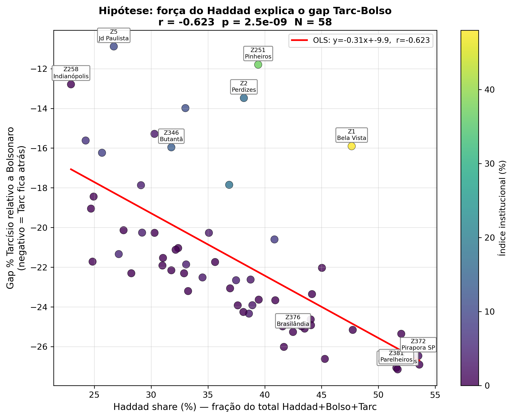

**Síntese conceitual:**

- **Esquerda**: ambiente institucional cultural-progressista **gera voto adicional** independente do nível eleitoral (R²=0.31).
- **Direita**: gradiente é **socioeconômico** — zonas periféricas mais personalistas, zonas ricas mais pragmáticas. Índice prediz a transferência (r=0.60) mas não o volume.

*Replicate with:* `src/sintese/comparacao_bolsonaro_tarcisio_2022.py`, `competicao_haddad_tarcisio.py`

---

### Oitavo achado — Eficiência eleitoral: votos por R$ por arquétipo de candidato

*Eighth finding — Electoral efficiency: votes per R$ by candidate archetype*

Cruzando 555 eleitos em 6 cargos com receitas declaradas (R$ corrigidos para 2024), classificados por arquétipo via regex no nome de urna:

| Arquétipo | N | Custo mediano por voto |
|---|---:|---:|
| Coletivo/Mandata | 4 | **R$ 3.30** (mais aceito) |
| Segurança (PMs, delegados) | 32 | R$ 4.65 |
| Religioso (pastores, padres) | 4 | R$ 9.00 |
| Outros | 484 | R$ 13.40 |
| Familiar/Dinastia | 11 | R$ 14.30 |
| Profissional (Dr./Prof./Eng.) | 20 | **R$ 17.50** (menos aceito) |

**Padrão:** identidade tribal pré-formada → menor custo de conversão. Cargos majoritários (Senador, Governador) custam menos por voto absoluto (R$ 0.50–4.40); cargos proporcionais (Vereador, Dep. Estadual) custam mais (R$ 8–32).

**Top eficiência absoluta** (R$/voto ≈ 0): Janaina Paschoal, Major Olímpio, Eduardo Bolsonaro — todos PSL 2018, onda bolsonarista produziu candidatos com base ideológica via redes sociais que dispensaram financiamento tradicional.

**Trajetória 2012-2024 (vereador SP):**

| Ano | Receita total (R$M 2024) | Esquerda R$/voto | Direita R$/voto |
|---|---:|---:|---:|
| 2012 (financiamento empresarial) | 92.5 | 55.5 | 28.2 |
| 2016 (pós-reforma) | 33.2 | **11.0** | 20.0 |
| 2020 (pandemia) | 29.6 | **12.8** | 19.2 |
| 2024 (Fundão) | 75.9 | 26.2 | 26.0 |

A esquerda foi 2× mais eficiente em 2016-2020. Em 2024 **convergiu** com a direita — vantagem militante encerrada.

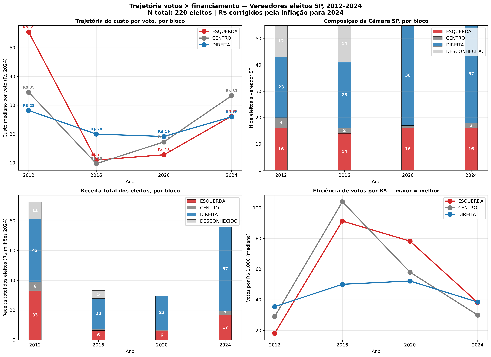
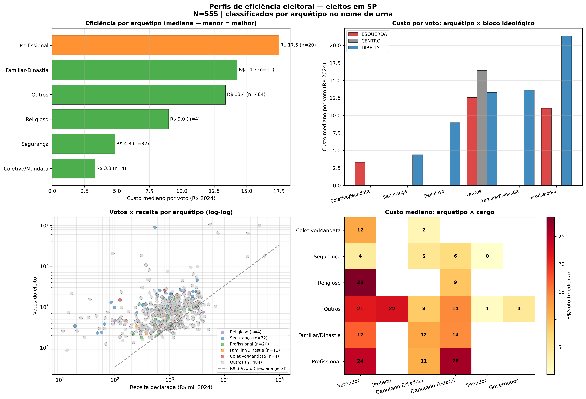

*Replicate with:* `src/sintese/votos_vs_financiamento_temporal.py`, `votos_vs_financiamento_todos_cargos.py`, `perfis_eficiencia_eleitoral.py`

---

## Estrutura / Structure

```
democracia-em-dados/
├── src/
│   ├── dominio/             # POO base: Candidato, ResultadoEleitoral, EleicaoMunicipal, LocalVotacao
│   ├── ingestao/            # TSEDownloader, carga MySQL (1998-2024)
│   ├── partidario/          # Volatilidade, ideologia (Bolognesi), LISA, Moran
│   ├── urbano/              # Índice institucional, mapas corredor, socioeconomia
│   ├── sintese/             # Análises transversais — testes de robustez, financiamento
│   ├── financiamento/       # Trajetórias e gráficos de financiamento
│   └── casos/sjbv/          # Replicação em SJBV (cidade-caso)
├── tests/                   # pytest — 113+ testes
├── scripts/sql/             # Schema MySQL + queries (5 arquivos: queries_eleitorais,
│                            #   queries_serie_temporal, queries_dep_federal_serie,
│                            #   queries_dia3, schema_tse)
├── reports/                 # Achados em markdown (inventário CEM, achados SQL,
│                            #   análise zonas, disponibilidade de dados etc.)
├── outputs/
│   ├── figures/             # ~40 figuras (mapas, scatter, heatmaps)
│   └── tables/              # CSVs de resultados (regressões, eficiências)
└── data/
    ├── raw/                 # Censo 2010, Censo 2022, TSE, shapes (.gitignore)
    └── processed/           # parquets (TSE 1998-2024 SP, prestação de contas)
```

**Banco MySQL `democracia_em_dados`** (588.978 linhas, 14 eleições 1998-2024):

| Tabela | Linhas |
|---|---:|
| municipio | 645 |
| zona_eleitoral | 878 |
| partido | 36 |
| cargo | 6 |
| eleicao | 92 |
| votacao_partido_munzona | 588.978 |

---

## Como rodar / How to run

```bash
conda activate radiografia
pip install pytest
pytest tests/ -q
python exemplo.py
```

---

## Roadmap — 16 semanas / 16-week roadmap

| Semana | Foco | Entregável |
|---|---|---|
| 1 | POO + testes + Git | `Candidato`, `ResultadoEleitoral`, 19 testes ✅ |
| 2 | Composição + pacote `src/` | `EleicaoMunicipal`, fragmentação, volatilidade ✅ |
| 3 | Ingestão TSE via API | `TSEDownloader` (POO), dados em parquet ✅ |
| 4 | SQL — modelagem | Schema MySQL normalizado, carga inicial ✅ |
| 5 | SQL — eixo competição | Window functions, CTEs, 5 arquivos de queries ✅ |
| 6 | SQL — eixo financiamento | Custo por voto, eficiência por arquétipo ✅ |
| 7 | Regressão linear + diagnóstico | OLS, R², LOO CV, controle por covariáveis ✅ |
| 8 | Regressão logística | Odds ratios, efeitos marginais |
| 9 | Inferência causal (DiD) | Casos discordantes, quasi-experimental ✅ (parcial) |
| 10 | Pipeline ML | ColumnTransformer, CV estratificada |
| 11 | Comparação de modelos | LogReg, RF, XGBoost, LightGBM + SHAP |
| 12 | NLP baseline + deploy | TF-IDF, FastAPI, Docker |
| 13 | Análise espacial | Moran I, LISA, mapas coropléticos ✅ |
| 14 | PCA + índices sintéticos | PCA agnóstico equipamentos, índice institucional ✅ |
| 15 | Modelos de contagem | Poisson, NB, Zero-inflated |
| 16 | Multinível + cloud | Modelo hierárquico, deploy AWS |

**Status atual: testes estatísticos completos + análise de financiamento + ETL Censo 2010/2022 + 113+ testes pytest passando.**

---

## Stack

Python 3.11, pandas, scikit-learn, statsmodels, pytest, MySQL, FastAPI, Docker.

---

## Licença / License

MIT
